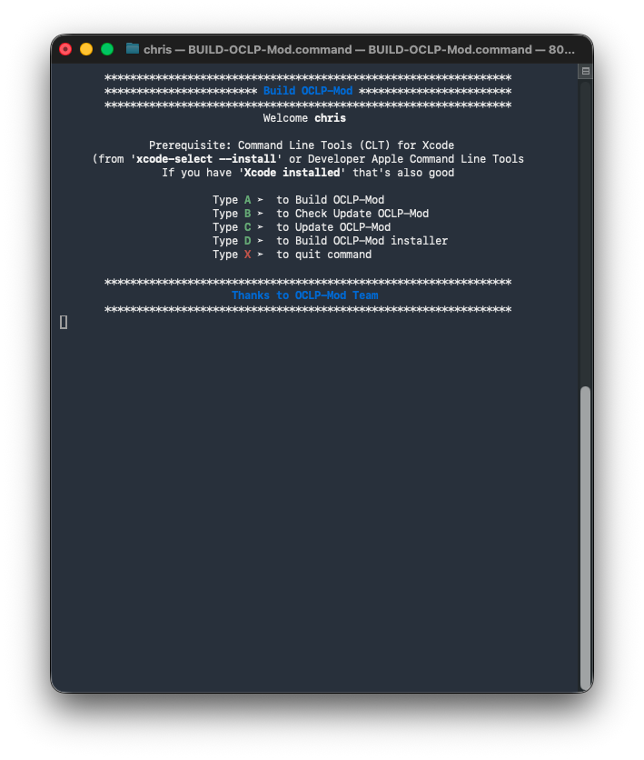
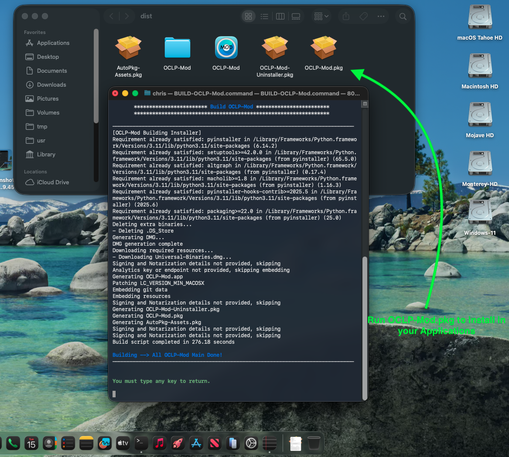

Usage BUILD-OCLP-Mod testing on macOS Tahoe 26 and macOS Sequoia 15.6

- [x] `Clone and Build OCLP-Mod:`
```bash
git clone https://github.com/chris1111/BUILD-OCLP-Mod.git && ./BUILD-OCLP-Mod/SetIcon/seticon -d ./BUILD-OCLP-Mod/SetIcon/AppIcon.icns ./BUILD-OCLP-Mod/BUILD-OCLP-Mod.command && Open ./BUILD-OCLP-Mod
```

### Prerequisite: Command Line Tools (CLT) for Xcode
- from `xcode-select —install`
- Or Developer Apple Command Line Tools
- If you have `Xcode installed` that's also good






