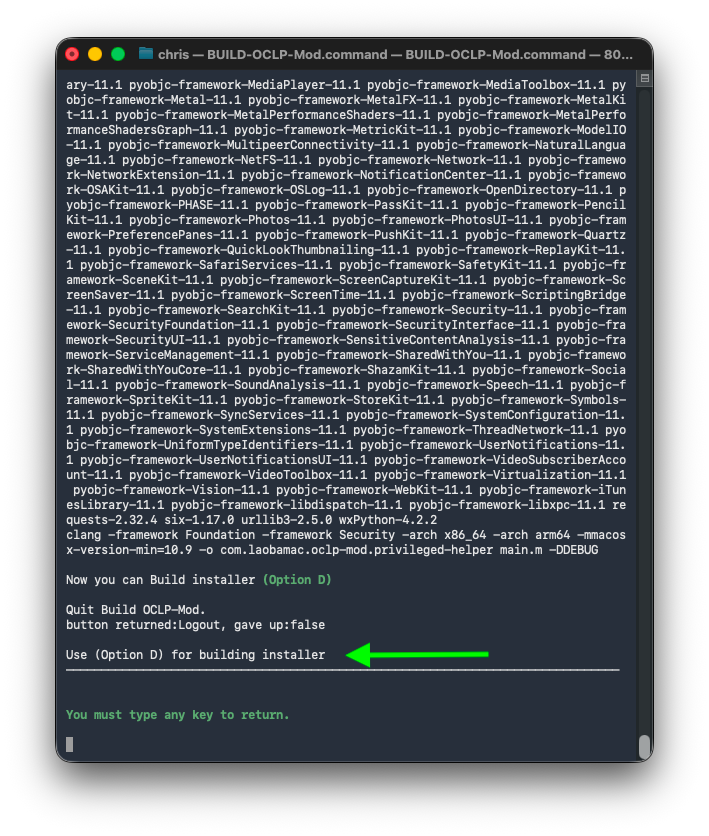

Usage BUILD-OCLP-Mod testing on macOS Tahoe 26 and macOS Sequoia 15.6
### Prerequisite: Command Line Tools (CLT) for Xcode
- from `xcode-select —install`
- Or Developer Apple Command Line Tools
- If you have `Xcode installed` that's also good

